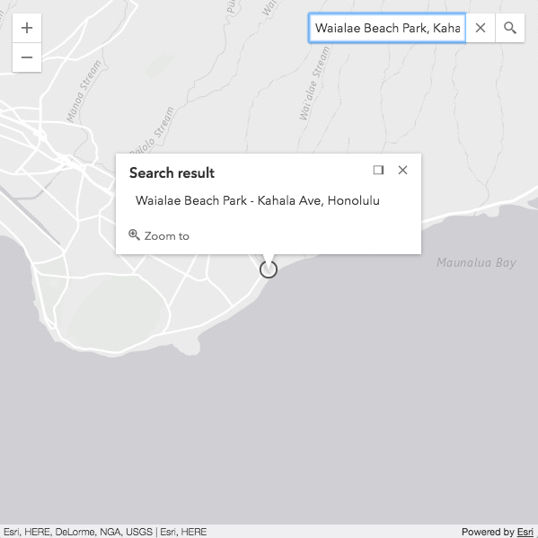
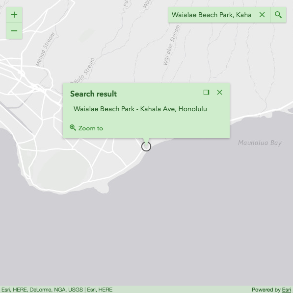
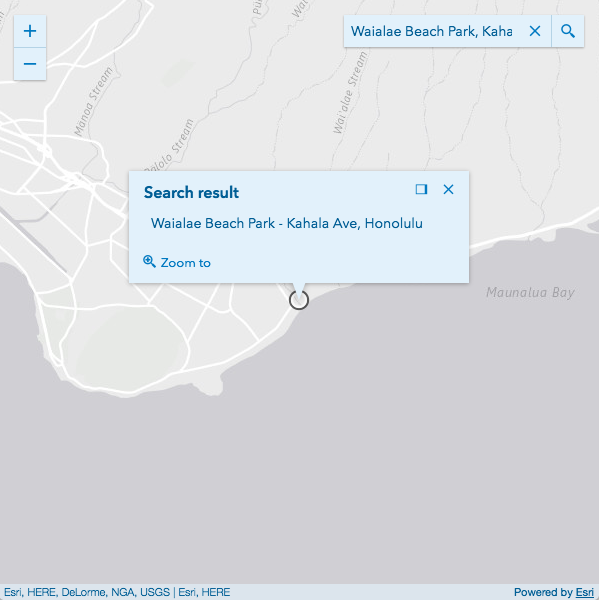

# Sass
======

This is a sample setup showing how to use [Bower](http://bower.io/) to customize the CSS for your [ArcGIS API for JavaScript](https://developers.arcgis.com/javascript/) application. It provides a Gruntfile needed to compile Sass.

# Requirements
* [node & npm](https://nodejs.org/)
* [bower](http://bower.io/)
* [grunt](http://gruntjs.com/)

# Usage
* `npm install -g bower` - installs bower globally
* `npm install` - installs required node and bower packages
* `npm run sass` - compiles the Sass files

# Files of interest

* `esri/css/main.scss` - includes all styles
* `esri/css/view.scss` - includes the minimum amount of styles for a basic map
* `esri/widgets/css/_ColorVariables.scss`
* `esri/widgets/css/_CommonVariables.scss`

## Theming

You'll need to open the `_ColorVariables.scss` file. We'll be focusing on the following portion of the file for our changes.

```
//  Main Colors Vars
$text_color                 : $Calcite_Gray_700;
$background_color           : $Calcite_Gray_050;
$anchor_color               : $Calcite_Gray_550;
$anchor_hover_color         : $Calcite_Gray_700;
$button_text_color          : $Calcite_Gray_550;
$button_text_hover_color    : $Calcite_Gray_700;
```

This is where the colors used by widgets are defined. These values produce the default theme.

The variables reference color definitions from the [calcite-colors](https://github.com/Esri/calcite-colors/) repository. Color values can be used too, see the following for more information ([Sass colors](http://sass-lang.com/documentation/file.SASS_REFERENCE.html#colors)). 



Let's change the variables to customize the colors to create a different theme.

```
//  Main Colors Vars
$text_color                 : $Calcite_Highlight_Green_400;
$background_color           : $Calcite_Highlight_Green_100;
$anchor_color               : $Calcite_Highlight_Green_350;
$anchor_hover_color         : $Calcite_Highlight_Green_400;
$button_text_color          : $Calcite_Highlight_Green_350;
$button_text_hover_color    : $Calcite_Highlight_Green_400;
```

We can then run the npm script

```
npm run sass 
```

Presto! Our custom CSS is ready.



Creating a different theme is just a matter of using a different set of colors and repeating the previous steps.

```
//  Main Colors Vars
$text_color                 : $Calcite_Highlight_Blue_400;
$background_color           : $Calcite_Highlight_Blue_100;
$anchor_color               : $Calcite_Highlight_Blue_350;
$anchor_hover_color         : $Calcite_Highlight_Blue_400;
$button_text_color          : $Calcite_Highlight_Blue_350;
$button_text_hover_color    : $Calcite_Highlight_Blue_400;
```


