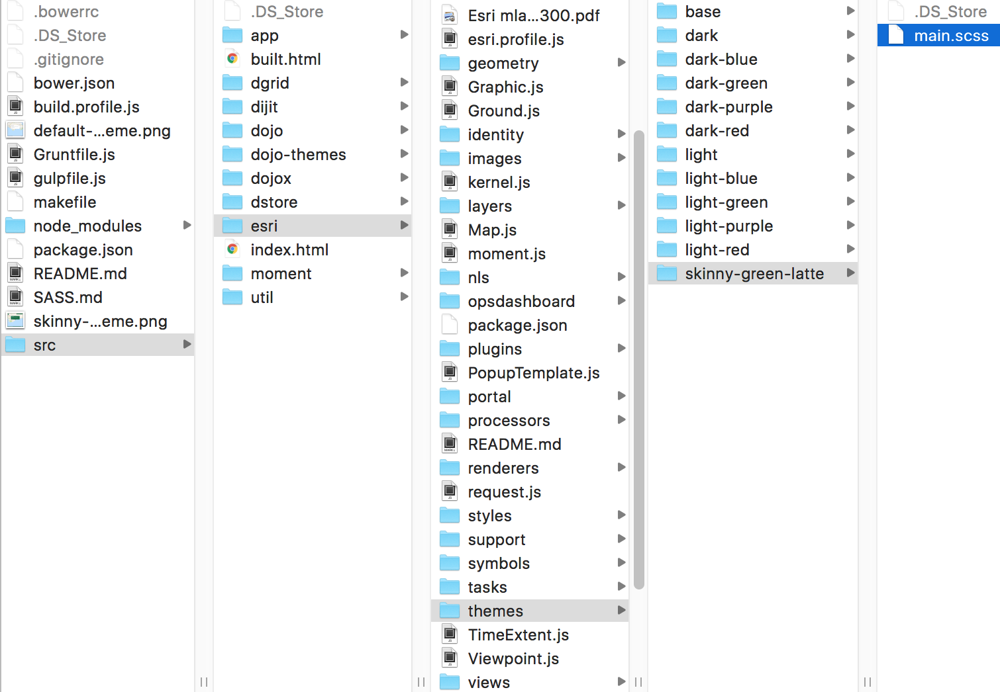

# Sass

This is a sample setup showing how to use [Bower](http://bower.io/) to customize the CSS for your [ArcGIS API for JavaScript](https://developers.arcgis.com/javascript/) application. It provides a Gruntfile needed to compile Sass.

## Requirements
* [node & npm](https://nodejs.org/)
* [bower](http://bower.io/)
* [grunt](http://gruntjs.com/)

## Usage
* `npm install -g bower` - installs bower globally
* `npm install` - installs required node and bower packages
* `npm run styles` - compiles the Sass files

## Structure

The following is a simplified look at the themes folder structure:

```
esri/
+-- themes/
    +-- base/
    |   +-- colors
    |   +-- fonts
    |   +-- icons
    |   +-- images
    |   +-- widgets
    |
    +-- <theme>
        +-- main.scss
```

`base` contains the foundation for all themes. Here is where we define variables, functions, mixins, and other helpers, such as color, font, and icon resources.

Each theme folder has a `main.scss` file which will produce a matching `css` file when compiled.

## Working with Themes

Each theme has a `main.scss` and the simplest way to get started is to to define any variable overrides, and then import `esri/themes/base/_core.scss`.

```scss
/*
  Theme: My custom theme
*/

// variable overrides
$some_variable_to_override : <overridden value>;

// import theme base
@import "../base/core";
```

If you want more control, you can also create the theme to your liking and import any base dependencies as needed.

```scss
@import "../base/mixins";  // mixins are now available for use

// custom scss goes here
```

By default `_core.scss` will include the styles for all widget. You can make the output stylesheets leaner by excluding widget styles. Excluding widget styles is now simpler.

```scss
// exclude non-default widgets
$include_BasemapToggle    : false;
$include_ColorPicker      : false;
$include_HorizontalSlider : false;
$include_Legend           : false;
$include_RendererSlider   : false;
$include_Ripple           : false;
$include_Search           : false;
$include_Tags             : false;

// import theme base
@import "../base/core";
```

## Example

We'll cover how to create a custom theme in this section.

First, we'll create our main theme file (`main.scss`) and place it under `esri/themes/skinny-green-latte/`



Then we import our core dependencies.

```scss
// import theme base
@import "../base/core";
```

Running `npm run styles` at this point would produce the light theme (default).


This is because `_core.scss` is the base for the default theme.

In order to customize our theme, we can override variables that affect color and font/button sizes.

```scss
/*
  Theme: Skinny Green Latte
*/

// variable overrides
$button_width               : 28px;
$button_height              : 28px;

$text_size                  : 12px;

$text_color                 : #fff;
$background_color           : #00704a;
$anchor_color               : #00704a;
$anchor_hover_color         : #000;
$button_text_color          : #fff;
$button_text_hover_color    : #000;

// import theme base
@import "../base/core";
```

If we run `npm run styles` now, our custom theme would be compiled and ready to use!


All you need to do now is to import the output `main.css` in your application.

```html
<link rel="stylesheet" href="./esri/themes/skinny-green-latte/main.css">
```
